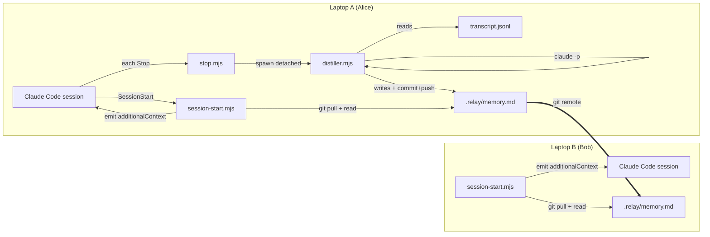
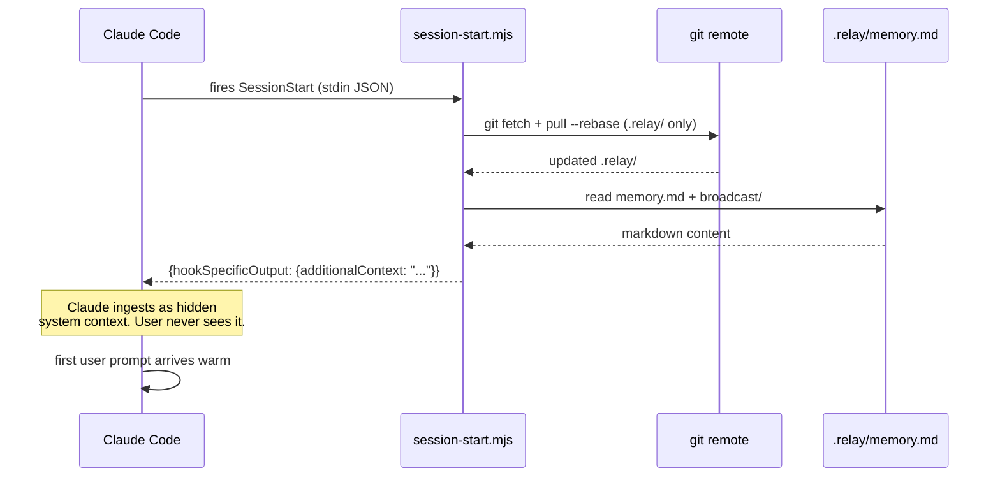
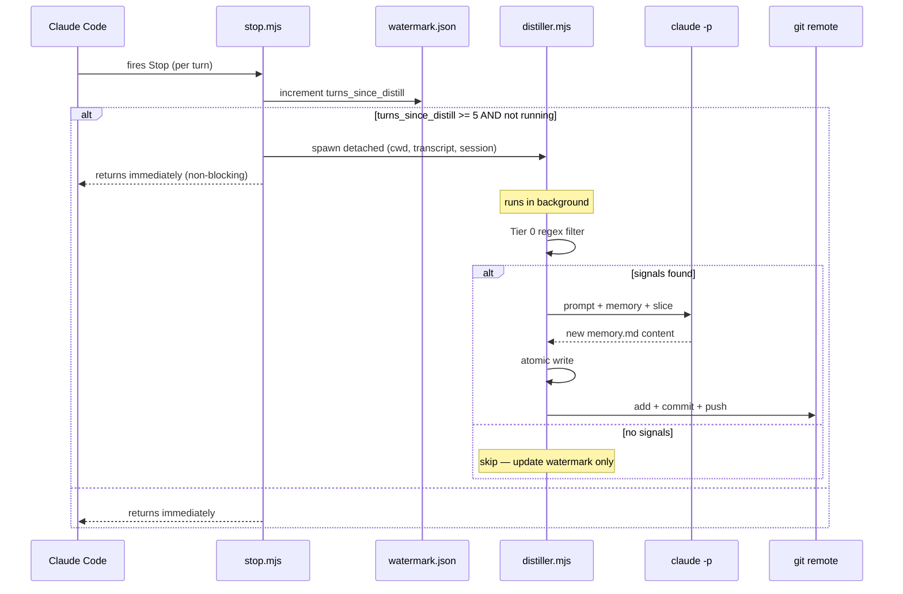

## Two laptops, one brain



## Session-start sequence



## Stop-hook + distiller sequence



## Component breakdown

| Component | File | Purpose |
|---|---|---|
| **Hook manifest** | `hooks/hooks.json` | Registers `SessionStart` + `Stop` with Claude Code. |
| **Session-start hook** | `hooks/session-start.mjs` | Pulls, reads memory + broadcast, emits `additionalContext`. |
| **Stop hook** | `hooks/stop.mjs` | Debounces, spawns distiller detached. Never blocks. |
| **Distiller** | `distiller.mjs` | Tier 0 filter → `claude -p` → atomic write → push. The core IP. |
| **Transcript parser** | `lib/transcript.mjs` | JSONL streaming + since-watermark slicer + compact rendering. |
| **Memory helper** | `lib/memory.mjs` | `memory.md` atomic read/write, schema helpers. |
| **Sync layer** | `lib/sync.mjs` | `RelaySync` interface; `GitSync` default impl. Pluggable. |
| **CLI** | `bin/relay` | `init`, `status`, `distill`, `broadcast-skill`. |
| **Prompt** | `prompts/distill.md` | The hygiene-respecting distiller system prompt. |

## File layout (plugin)

```
~/.claude/plugins/relay/
├── hooks/
│   ├── hooks.json               # plugin manifest, registers SessionStart + Stop
│   ├── session-start.mjs        # runs on SessionStart; injects memory
│   └── stop.mjs                 # runs on every Stop; triggers distiller
├── lib/
│   ├── sync.mjs                 # RelaySync interface + GitSync implementation
│   ├── transcript.mjs           # JSONL parser, since-watermark slicer
│   └── memory.mjs               # memory.md read/write (atomic)
├── prompts/
│   └── distill.md               # distiller system prompt (THE core IP)
├── commands/
│   └── handoff.md               # /relay-handoff slash command (stretch)
├── distiller.mjs                # background distillation process
├── bin/
│   └── relay                    # CLI: relay init, relay status, relay distill
├── package.json                 # "type": "module", deps: none (uses claude CLI)
└── README.md
```

## File layout (target repo)

```
<repo>/
├── .relay/
│   ├── memory.md                # git-tracked, human-readable
│   ├── broadcast/               # git-tracked — skills + CLAUDE.md overrides
│   │   ├── CLAUDE.md            # (optional) team-wide override
│   │   └── skills/*.md          # (optional) shared skills
│   ├── state/
│   │   └── watermark.json       # per-machine, NOT git-tracked
│   └── log                      # per-machine, NOT git-tracked
└── .gitignore                   # appended: .relay/state/, .relay/log
```

## Injection point — why `SessionStart`

Claude Code's `SessionStart` hook is the **only** surface that injects hidden system context at session initialization. Confirmed from:

- [Official hooks reference](https://code.claude.com/docs/en/hooks) — `SessionStart` output field `additionalContext` is documented as injected system context.
- Plugin source (caveman, superpowers) — both use `SessionStart` for this exact pattern.

MCP servers are tool-invocable only — they can't inject at init. Relay therefore uses hooks, not MCP, for the core injection path.

## Sync layer — why git

- **Zero infra.** Every team uses git anyway.
- **Works LAN + WAN identically.** Same protocol.
- **Free version history.** `git log .relay/memory.md` tells the story of the project's mind.
- **Pluggable.** `RelaySync` interface is abstract; `GitSync` is default. A future `CloudSync` (Cloudflare KV, Supabase, whatever) swaps in without touching the hooks.

## Race handling

Two distillers pushing the same second is rare but real. Strategy:

1. **Path-scoped push.** Only `.relay/*` is touched. Main code never pushed by the hook.
2. **Retry-on-conflict.** If `git push` fails (non-fast-forward), pull-rebase, re-distill against the latest-pulled memory, retry. Bounded at 3 attempts.
3. **Advisory lock.** `.relay/state/.lock` per machine. Steals if held > 60s.

For 2-10 person teams, this is sufficient. Beyond that, move to `CloudSync`.
