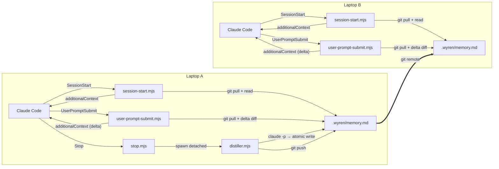
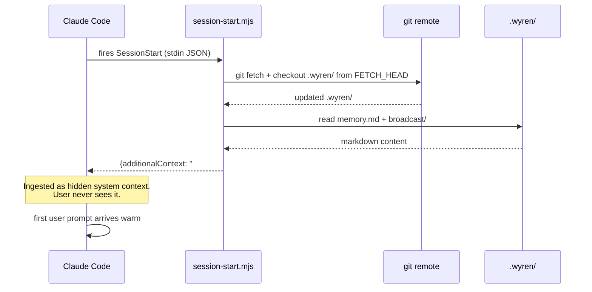
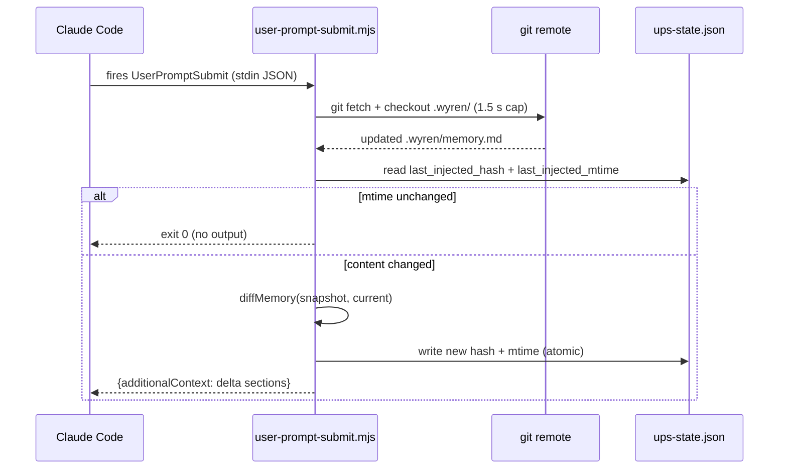
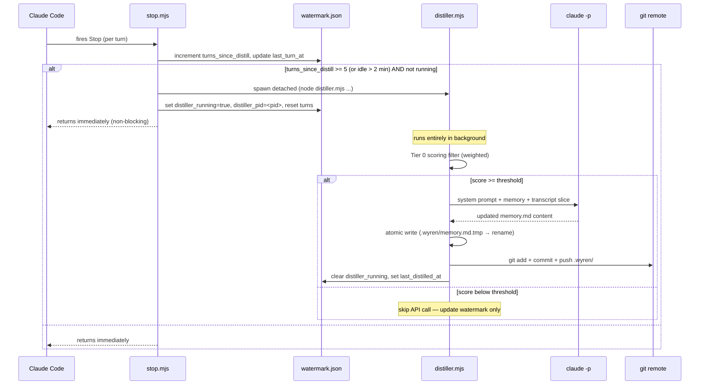

## Overview

Three hooks wire Wyren into Claude Code. All three are fail-open: any error logs to `.wyren/log` and exits 0 — Wyren never breaks a session.



## Session-start sequence

Fires once per new Claude Code session. Budget: **2 s** (fetch 1.5 s + checkout 0.5 s).



## UserPromptSubmit sequence

Fires on every user turn. Budget: **3 s** (fetch 1.5 s + checkout 0.5 s + diff). Injects only the delta — new sections added since last injection — not the full memory.



## Stop-hook + distiller sequence

Fires on every Stop event. Returns immediately — distiller runs detached. Budget for hook itself: **5 s** (just watermark + optional spawn).



## State file ownership

Three state files live in `.wyren/state/`. They are deliberately separate to eliminate read-modify-write races between concurrent hooks.

| File | Owner | Fields |
|---|---|---|
| `watermark.json` | `stop.mjs` | `turns_since_distill`, `last_turn_at`, `last_distilled_at`, `distiller_running`, `distiller_pid`, `last_uuid` |
| `ups-state.json` | `user-prompt-submit.mjs` | `last_injected_mtime`, `last_injected_hash` |
| `last-injected-memory.md` | `user-prompt-submit.mjs` | Full text of the last memory snapshot — used as the diff base each turn |

Both files are in `.wyren/state/` which is gitignored (per-machine state). Neither is ever written by the other hook.

`stop.mjs` additionally maintains a PID liveness check: if `distiller_running` is set but `process.kill(pid, 0)` throws `ESRCH`, the flag is stale (process died) and is cleared automatically.

## Component breakdown

| Component | File | Purpose |
|---|---|---|
| **Hook manifest** | `hooks/hooks.json` | Registers `SessionStart`, `Stop`, `UserPromptSubmit` with Claude Code. |
| **Hook dispatcher** | `hooks/run-hook.cmd` | Polyglot bash+cmd shim — routes to the correct `.mjs` on both Unix and Windows. |
| **Session-start hook** | `hooks/session-start.mjs` | Pulls, reads memory + broadcast dir, emits full `additionalContext`. |
| **UserPromptSubmit hook** | `hooks/user-prompt-submit.mjs` | Pulls per turn, diffs against stored snapshot, emits only delta. |
| **Stop hook** | `hooks/stop.mjs` | Increments watermark, spawns distiller detached when threshold reached. Never blocks. |
| **Distiller** | `distiller.mjs` | Tier 0 filter → `claude -p` → atomic write → git push. Core IP. |
| **Tier 0 filter** | `lib/filter.mjs` | Weighted `scoreTier0()` — kills ~70% of triggers before any API call. |
| **Diff engine** | `lib/diff-memory.mjs` | `diffMemory`, `renderDelta`, `hashMemory` — pure functions, no I/O. |
| **Transcript parser** | `lib/transcript.mjs` | JSONL streaming, since-watermark slicer, compact prose renderer. |
| **Memory helper** | `lib/memory.mjs` | `memory.md` atomic read/write. |
| **Sync layer** | `lib/sync.mjs` | `WyrenSync` interface; `GitSync` default impl (pull/push/lock). Pluggable. |
| **CLI** | `bin/wyren.mjs` | `init`, `status`, `distill`, `broadcast-skill`, `install`, `update`, `uninstall`, `doctor`, `log`. |
| **Installer** | `scripts/installer.mjs` | Cross-platform install/update/uninstall/doctor logic (zero deps). |
| **Prompt** | `prompts/distill.md` | Distiller system prompt. |

## File layout (plugin)

The installer clones Wyren to `~/.claude/wyren/` and creates a symlink/junction at `~/.claude/plugins/wyren/` pointing to it. Files live in the clone; the junction is the plugin mount point.

```
~/.claude/wyren/
├── hooks/
│   ├── hooks.json                # plugin manifest: SessionStart + Stop + UserPromptSubmit
│   ├── run-hook.cmd              # polyglot bash+cmd dispatcher (self-locates CLAUDE_PLUGIN_ROOT)
│   ├── session-start.mjs         # SessionStart hook — injects memory + broadcast
│   ├── stop.mjs                  # Stop hook — watermark + detached distiller spawn
│   └── user-prompt-submit.mjs    # UserPromptSubmit hook — live sync delta injection
├── lib/
│   ├── sync.mjs                  # WyrenSync interface + GitSync implementation
│   ├── transcript.mjs            # JSONL parser, since-watermark slicer
│   ├── memory.mjs                # memory.md read/write (atomic)
│   ├── filter.mjs                # Tier 0 weighted scoring filter
│   └── diff-memory.mjs           # section diff + delta renderer
├── prompts/
│   └── distill.md                # distiller system prompt (core IP)
├── commands/
│   └── wyren-handoff.toml        # /wyren-handoff slash command
├── scripts/
│   └── installer.mjs             # install/update/uninstall/doctor logic
├── distiller.mjs                 # background distillation process
├── bin/
│   └── wyren.mjs                 # CLI entrypoint
├── package.json                  # "type": "module", zero runtime deps
└── README.md
```

## File layout (target repo)

```
<repo>/
├── .wyren/
│   ├── memory.md                 # git-tracked, human-readable shared memory
│   ├── broadcast/                # git-tracked — team skills + CLAUDE.md overrides
│   │   ├── CLAUDE.md             # (optional) team-wide Claude Code context override
│   │   └── skills/               # (optional) shared skill files
│   ├── state/                    # NOT git-tracked (per-machine)
│   │   ├── watermark.json        # owned by stop.mjs
│   │   ├── ups-state.json        # owned by user-prompt-submit.mjs
│   │   └── last-injected-memory.md  # owned by user-prompt-submit.mjs (diff base)
│   └── log                       # per-machine append log, NOT git-tracked
└── .gitignore                    # .wyren/state/ and .wyren/log appended by wyren init
```

## Injection point — why `SessionStart`

Claude Code's `SessionStart` hook is the only surface that injects hidden system context at session initialization. The `additionalContext` field in the hook response is documented as injected system context — users never see it directly.

MCP servers are tool-invocable only — they can't inject at init. Wyren uses hooks, not MCP, for the core injection path. UserPromptSubmit extends this by re-injecting deltas as sessions evolve.

## Sync layer — why git

- **Zero infra.** Every team uses git already.
- **Works LAN + WAN identically.** Same protocol, same credentials.
- **Free version history.** `git log .wyren/memory.md` shows how the team's shared context evolved.
- **Pluggable.** `WyrenSync` interface is abstract; `GitSync` is the default. An alternative backend swaps in without touching the hooks.

## Race handling

Two distillers pushing concurrently is rare but real. Wyren uses three layers of defense:

1. **Path-scoped push.** Only `.wyren/memory.md` and `.wyren/broadcast/` are ever staged. Main code is never touched.
2. **Retry-on-conflict.** If `git push` fails (non-fast-forward), `GitSync.push()` pulls, re-distills against the merged base, retries. Bounded at 3 attempts.
3. **Advisory lock.** `.wyren/state/.lock` prevents concurrent distillers on the same machine. Stolen if held > 60 s (handles killed processes).
